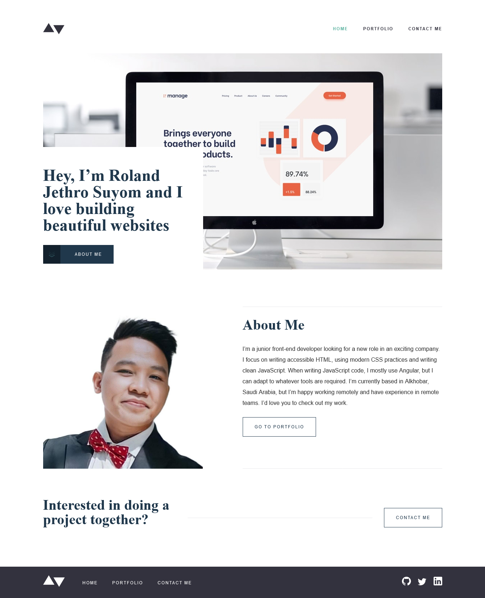

# Frontend Mentor - Minimalist portfolio website solution

This is my solution to the [Minimalist portfolio website challenge on Frontend Mentor](https://www.frontendmentor.io/challenges/minimalist-portfolio-website-LMy-ZRyiE). Frontend Mentor challenges help you improve your coding skills by building realistic projects. 

## Table of contents

- [Overview](#overview)
  - [The challenge](#the-challenge)
  - [Screenshot](#screenshot)
  - [Links](#links)
- [My process](#my-process)
  - [Built with](#built-with)
  - [What I learned](#what-i-learned)
  - [Continued development](#continued-development)
  - [Useful resources](#useful-resources)
- [Author](#author)
- [Acknowledgments](#acknowledgments)


## Overview

### The challenge

Users should be able to:

- View the optimal layout for each page depending on their device's screen size
- See hover states for all interactive elements throughout the site
- Click the "About Me" call-to-action on the homepage and have the screen scroll down to the next section
- Receive an error message when the contact form is submitted if:
  - The `Name`, `Email Address` or `Message` fields are empty should show "This field is required"
  - The `Email Address` is not formatted correctly should show "Please use a valid email address"

### Screenshot




### Links

- Solution URL: [Add solution URL here](https://your-solution-url.com)
- Live Site URL: [Add live site URL here](https://reliable-sunburst-ffc76e.netlify.app/index.html)

## My process

### Built with

- Semantic HTML5 markup
- CSS custom properties
- Flexbox
- CSS Grid
- JavaScript
- Mobile-first workflow


### What I learned

Although the challenge has a harcoded details, I converted those details in json file. I learned how to fetch data from a json source and manipulate those data to render to the view. I used [formspree.io](https://formspree.io/) to handle emails in the contact page. Here are some of my new learning.

- Form validation using JavaScript
- How to style navbar when we scrolled the page
- Improve my skills in styling using CSS

To see how you can add code snippets, see below:

```js
async function renderProjectsToTheView(width){
    let response  = await fetch("../assets/json/projects.json");
    if(response.status === 200){
        data = await response.text()
    }else {
        console.log("Error", response.statusText)
    }
    projects = JSON.parse(data);
    device = checkDevice(width);
    getProjectsData(projects, device)
}


const getProjectsData = (projects, device) => {
    let project = projects.filter ( proj => {return url.search(proj.name.toLowerCase()) > -1})[0];
    let index = projects.map( proj => proj.name).indexOf(project.name);
    let nextPrev = nextPreviousData(index, projects);
    let output = '';
    //console.log(nextPrev);
        if(project){
         output += `
        <div class="project">
            <div class="project__cover-image">
                
            </div>
            
            <div class="project__details">
                <div class="project__description border border--no-side">
                    <h1>${project.name}</h1>
                    <p>${project.description}</p>
                    <div class="interaction">
                        <p class="text-primary text-small"> Interaction Design / Front End Development </p>
                        <p class="text-primary text-small"> ${project.stack} </p>
                        <a class="btn btn-secondary" href="${project.website}" target="_blank"> Visit Website </a>
                    </div>
                </div>

                <div class="project__background">
                    <h2>Project Background</h2>
                    <p>${project.background}</p>
                    <div class="project__preview">
                        <h3>Static Preview</h3>
                        
                        
                    </div>
                </div>
            </div>
            
            

            <div class="links">
            <a  href="/projects/${nextPrev.previous.toLowerCase()}.html" class="link link--left border-right border border--no-side">
            
              <div class="link__texts">
                <h3>${nextPrev.previous}</h3>
                <p class="text-light">Previous Project</p>
              </div>
            </a>
            <a  href="/projects/${nextPrev.next.toLowerCase()}.html" class="link link--right border border--no-side">
            
              <div class="link__texts">
                <h3>${nextPrev.next}</h3>
                <p class="text-light">Next Project</p>
              </div>
            </a>
          </div>
        </div>
        `
           
        }else {
            console.log("Error: There is no such project");
        }
    portfolio.innerHTML = output;
}

const nextPreviousData = (index, projects) => {
    let name = {}
    if(index === 0) {
        name.previous = projects[projects.length - 1].name; 
        name.next = projects[1].name
    }else if( index === projects.length -1){
        name.previous = projects[index - 1].name; 
        name.next = projects[0].name
    }else {
        name.previous = projects[index - 1].name; 
        name.next = projects[index + 1].name
    }
    return name;
}

const checkDevice = (width) => {
    let device = "";
    if(width < 376){
        device = "mobile"
    }else if(width > 375 && width < 1150) {
            device = "tablet";
    }else if(width > 1151) {
        device = "desktop";
    }
    return device;
}

}
```


### Continued development

I want to dig more my frontend skills using framework and create projects to show it in my portfolio.


### Useful resources

- [formspree.io](https://formspree.io/) - handle form data without server side.
- [W3schools](https://www.w3schools.com/html/default.asp) - This is an amazing website which helped me finally understand some concept I needed to solve this challenge.


## Author

- Website - [Roland Jethro Suyom](https://reliable-sunburst-ffc76e.netlify.app/index.html)
- Frontend Mentor - [@Jeth0214](https://www.frontendmentor.io/profile/Jeth0214)
- Twitter - [@JethroSuyom](https://twitter.com/JethroSuyom)


## Acknowledgments

Credits to FrontEnd for creating this challenge. It helps a lot of developer on where to start on making projects to enhance thier skils. Also , [Coder Coder](https://www.youtube.com/results?search_query=coder+coder) for the utilities ideas in scss for making it easier to handle breakpoints and rem convertion.

